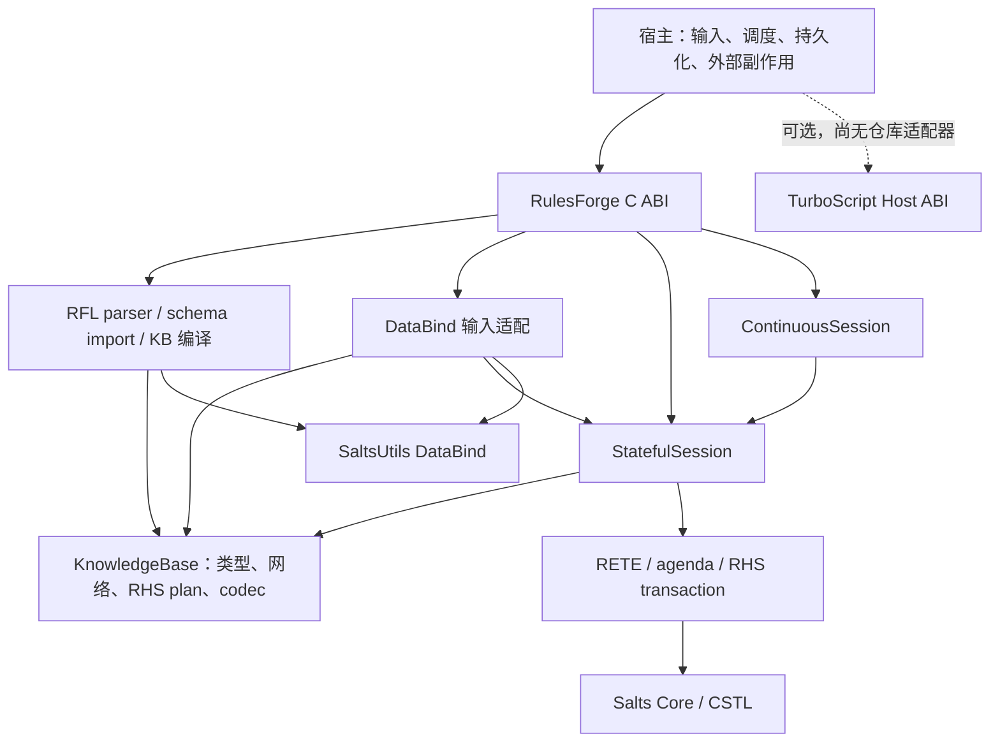

# RulesForge 架构与生态集成

状态：当前实现基线与后续集成决策。同步日期：2026-10-10。
本文覆盖整个 RulesForge；有界执行的详细交付契约见
[有界执行与 session 生命周期](bounded-execution.md)。标为“设计”的行为尚未实现。

## 版本与事实源

| 对象 | 本次核对基线 | 契约边界 |
| --- | --- | --- |
| RulesForge | `8b9127f148a3b54ad30c731bbc314ea74b15d976` 加现有工作区，项目 0.9.0 | [公开 C 头](../../include/rules_forge.h)、实现、正式测试优先于历史实施计划 |
| Salts | [2.3.0-rc.4](https://github.com/qigao/salts/releases/tag/v2.3.0-rc.4)，`233a0d1c2086808d85160ad70010e13b4c63d5c8` | Reflection ABI 4、Plugin ABI 5；native ABI/SONAME 已发生迁移；Unicode 归 Salts |
| SaltsUtils | [4.3.0-rc.2](https://github.com/qigao/salts-utils/releases/tag/v4.3.0-rc.2)，`c96a47b05292e3bbebba0b016c0b18c71bce8cde` | DataBind 3.0.0 / ABI 10，通过 `Salts::DataBind` 消费；不再导出重复的 `Salts::Unicode` |
| TurboScript | [`a89f8a718639794644ad2a129add471080db9c03`](https://github.com/qigao/TurboScript/tree/a89f8a718639794644ad2a129add471080db9c03)，3.0.9 | Host ABI 1、native ABI 3；均独立于 Plugin publication ABI |

Salts/SaltsUtils 基线使用用户指定的发布 tag 与固定源码提交；TurboScript 仍为本次
核对的 3.0.9。相邻 checkout 的差异记录在[有界执行基线](bounded-execution.md#背景与证据)。
项目版本、ABI epoch、发布包版本与测试资格分别记录，不能仅凭相同 epoch 推断二进制兼容。

本地验证：`win-release-user` 使用 `build/native-sdk-rc` 中的 Windows x64 Release
包和独立的 `build/Msvc-Release-rc` 构建目录。NuGet 包 SHA-256 与发布资产一致，
manifest 提交与上表一致；SaltsUtils 的生产端 manifest 记录其构建依赖为 Salts rc.2，
本次消费者实际使用 Salts rc.4。完整构建通过，正式 CTest preset 的非 benchmark
回归 **38/38 通过**，耗时 2.82 秒；接入执行准入保护后重新完成全量构建，
相邻回归 3/3、完整回归 **38/38 通过**，后者耗时 0.83 秒。此结果不覆盖
Debug/ASan、其他平台或可选 runtime。
包校验值、恢复命令与回滚范围见[部署指南](../DEPLOYMENT.md#sdk-alignment)。

## 分层与依赖

事实：[构建入口](../../CMakeLists.txt) 将 `rfl_parser` 静态库、
`rulesforge_engine_objects` 内部对象库组装进 `RulesForge` 共享库。
[C API target](../../capi/CMakeLists.txt) 安装公共头、动态库和
`RulesForge::RulesForge` CMake target；parser alias 和内部 C++ 头不构成安装 SDK。
C/C++ 消费者都通过同一 C ABI，不跨 DLL 传递内部 `Fact`、`ConstraintValue`、STL
容器、异常或 C++ owner。公共头包含 DataBind/平台头，因此 SDK 仍有明确的公共依赖。

| 层 | 当前归属与职责 | 不应转移给该层的责任 |
| --- | --- | --- |
| `parser/` | RFL 语法、语义校验、schema 导入、表达式表示 | 数据源线程、外部服务执行 |
| KnowledgeBase | 编译后的规则、类型注册、共享 RETE 网络、RHS plan、导入 codec | 每个 session 的工作内存或事件状态 |
| StatefulSession | facts、网络运行内存、agenda、匹配推进、RHS 事务、query | 持久化日志、broker 消费、脚本 context |
| ContinuousSession | event ID、watermark、retention、dedup、结果记账、确定性 replay | 自建时钟、线程、durable checkpoint |
| `capi/` | opaque handles、参数/类型校验、DataBind 转换、错误与释放边界 | 第二套规则执行器或 schema registry |
| 宿主 | owner 调度、输入限额、存储、输出交付、可选 runtime 适配 | 绕过 C ABI 修改内部 facts 或 agenda |

## 编译与规则执行

RFL/schema/decision table 是部署输入。parser 完成导入和校验后，
[`KnowledgeBase`](../../rulesforge/include/engine/knowledge_base.hpp) 构建 fact 类型、
RETE 网络和 [`RhsBackendPlan`](../../rulesforge/include/engine/rhs_backend_plan.hpp)。
每个 session 保持对 KB 的共享所有权，并分配独立的网络运行内存。
配置与加载必须在共享前完成；当前 API 没有通用 freeze handle 或热迁移协议。

事实：RHS 使用 `CppActionPlan`，由
[`RhsExecutor`](../../rulesforge/src/engine/rhs_executor.cpp) 执行命令并进入 session
事务。RFL 的表达式语法不是 TurboScript 语言契约，也没有 MIR/JIT 后端选项。
内部 native predicate/accumulator 扩展不是公开 C 注册接口；不因上游具备 Function
反射或脚本模块就把它们暴露为新的外部调用能力。

插入、更新、撤回及 deferred flush 驱动匹配，agenda 选择 activation 后执行 RHS。
`max_rules` 限制 activation 数量，不覆盖匹配复杂度或单条 RHS 的循环。
现有普通 fire 与 continuous 使用的 fail-fast fire 错误行为不同；
`StatefulSession::fire_activation` 在普通路径可消费 `ReteExecutionException`，
而 fail-fast 路径向上传播。因此不能将普通 fire 的计数直接解释为逐条 RHS 成功提交数。
共享 fire 入口现拒绝同 session 嵌套执行，reset 在执行期也抛出 `std::logic_error`；
RAII 保证退出释放准入。C API 沿用异常到 `RULES_FORGE_ERROR_GENERIC` 的映射，
不新增错误码。新的执行终态和计费仍属于有界执行设计。

## 状态、资源与失效边界

| 对象 | 主 owner | 保留与释放协议 |
| --- | --- | --- |
| KB / codec / 编译计划 | KB；session 持有 KB | 共享前停止修改；codec 借用覆盖输入操作 |
| fact / network / agenda | StatefulSession | opaque fact handle 不转移所有权；reset、撤回和 owner 销毁按公开契约使相关借用失效 |
| DataBind 输入 root/object | 调用方或 C API 临时 owner | 同步转换为 session-owned 字段；不保留 child/string 的裸指针 |
| DataBind stream | stream handle，借用 session | 与 session 同线程；finish 提交，失败后仅 destroy；活跃 stream 阻止 session destroy |
| query result | result handle | 通过 getter 借用 facts；按公开头的结果生命周期使用 |
| continuous result | 独立结果 handle | 拥有输出快照；destroy 与 session acknowledge 是不同操作 |
| 可选脚本 instance/result | 宿主 TurboScript context | 按 Host ABI 的 owner、view、重入和 Faulted 契约管理 |
| 可选 DLL descriptor/code | 宿主 Plugin registry + lease | 所有借用及清理结束后才 release/unload；复制指针不保活 |

内部仍有 C++ value/RAII 和容器；它们保留在实现边界内。Salts 的 CMeta/CSTL 能力
不是重写这些内部类型的理由。后续 C 边界适配优先复用 `tstr`/`vstr`、项目 `fmt.h`
和 `tlog`，并明确每次跨 owner 的复制或保活，不为表面统一改坏类型语义和 ABI。

## DataBind 与 CMeta 的职责

事实：[schema importer](../../parser/src/databind_schema_importer.cpp) 从导入的 DataBind
schema 得到 RulesForge 类型；KB 保留并复用 codec。`.schema` 是外部字段身份、别名、
wire 表示的来源，RFL declaration/FactTypeRegistry 是规则执行所需的投影。
不再解析另一份 schema 文本建立竞争事实源，也不把 native 内存偏移当作 wire offset。

[最新 DataBind](https://github.com/qigao/salts-utils/blob/c96a47b05292e3bbebba0b016c0b18c71bce8cde/databind/runtime/README.md)
属于 SaltsUtils；动态 root 是 opaque、拥有存储的值，accessor 返回借用 view。
原生对象路径复用 canonical CMeta graph、DataBind plans 和 `data_bind_native_*`；
旧 TBE typed runtime/公开宏已移除，不应按历史指南引入 `TBE_TYPED_*` 或
`TurboParser::DataBind`。RulesForge 当前走 dynamic-value 适配，无需新增 native binding
或运行时编译器。生成代码属于 build/CI 步骤，schema 与 payload 绑定属于 runtime。

[`ConstraintValue`](../../rulesforge/include/core/value_types.hpp) 的 `uint64_t`、UUID、
enum、decimal、bigint、money、时间和容器语义仍归 RulesForge。不能因另一 runtime
有 tagged value 就按 tag 数字、variant 序号或 descriptor 地址互换对象。
新适配必须显式处理每个支持的值域；超出目标表示时拒绝或采用预先约定的 schema，
不得统一压成 double/string、丢字段或用 JSON round-trip 掩盖转换损失。

输入流程与各格式 API 见[数据摄入](../DATA_INGESTION.md)。DataBind 的 stream byte/count
limits、query limits 与 RulesForge 的 fact/event/result limits 分别计量；当前 wrapper
使用 `DATA_BIND_STREAM_CONFIG_INIT` 的默认 stream 配置，没有公开其全部调参能力。
`feed` 不是提交点，增量输入也不等于无缓存。尤其 YAML 和不可流式路径可在 finish
才绑定；continuous adapter 在此之前保留 pending events，当前也未选择 callback-only
输出模式。容量规划必须包含 parser、绑定结果和待提交 facts 的同时存活成本。

## 连续处理与一致性

[`ContinuousSession`](../../rulesforge/src/engine/continuous_session.cpp) 串行驱动一个
StatefulSession。push/batch、watermark 和 drain 经过同一 operation 路径；成功记录
committed operation 并发布 batch。输出容量拒绝可能发生在执行后，此时移除本次
operation 并 replay 已提交历史；恢复失败使 session 不一致并拒绝继续使用。

结果只收集本 step 新建且仍存活、类型被选中的 facts；不是整个 working memory 的
快照，也不自动报告此前已有 fact 的更新。ack 按顺序释放 pending accounting，
不释放调用方持有的结果副本。batch ID 从每个 session 的 1 开始；跨 session、重建或
进程重启的交付需要宿主稳定的运行标识/业务事件标识，不能单独以 batch ID 全局去重。

事实：配置约束 active events、dedup、pending results、input batch 和 replay operation
数量，不是全局 allocator 或 CPU 上限。derived facts、agenda、字段大小、临时输出、
已 ack 但未释放的结果还需要各自管理；replay 历史目前不随 ack 自动压缩。
`max_replay_steps` 耗尽时拒绝新增相应工作，不隐式 checkpoint 或丢弃恢复历史。
broker offset、持久化 checkpoint、outbox 和跨进程 exactly-once 均由宿主协议提供。

## TurboScript / Plugin 集成选择

选择：维持 RulesForge 独立的过滤与推理核心，由宿主通过两套公开 C API 组合
RulesForge 和 TurboScript。当前仓库没有该适配器，也没有 TurboScript link dependency。

| 候选 | 选择与代价 |
| --- | --- |
| 用 TurboScript 替换 RFL RHS / RETE | 不采用；会改变语言、事务、错误和执行归属，且无法由现有预算约束 native 匹配 |
| 直接共享 `ConstraintValue` / ExprTk 内部值 | 不采用；native ABI、精确值域、allocator 和 owner 不同 |
| 宿主显式转换并调用已解析的 Host export | 后续集成方向；保持引擎独立，代价是转换、错误映射和分别验证预算 |
| 在 RulesForge 内另建插件 registry | 不采用；模块生命周期继续由宿主 Salts Plugin registry 管理 |

TurboScript 3.0.9 已公开 module/instance/result Host ABI；宿主可编译、解析 export，
选择固定 interpreter/JIT 模式，再传入有界值视图。Host ABI 的值域仅包含 null、bool、
int64、number、string、array、record，并不自动覆盖全部 RulesForge 扩展类型。
跨调用结果必须复制到接收方存储。脚本错误、取消和 Faulted 不等价于 RulesForge
回滚；在没有单独事务协议前，脚本只在明确的提交边界前后由宿主调用。

上游 native Plugin 使用 Salts publication ABI 5、canonical Function/Interface，
TurboScript module adapter 是 `turboscript.module` v1。上游还可准备 DataBind Service
BindingPlan，但这不使 RulesForge 自动成为 Service provider，也不开放 RFL 外部调用。
若未来发布 provider，使用当前 CMeta 精确调用声明与宿主 lease，独立版本化应用 contract。
静态能力声明用 `cmeta_component`，不混淆 metadata、加载权限、执行权限和生命周期。
详细 budget、重入和可重试关闭门槛以[有界执行设计](bounded-execution.md)为准。

## 同批生态发布与宿主边界

下表记录用户指定的发布契约与后续组合方向。当前 RulesForge 没有这些组件的链接依赖
或适配器；这些发布的上游测试不能替代 RulesForge 宿主集成测试。

| 组件 / 发布事实 | RulesForge 的组合方向与限制 |
| --- | --- |
| [TurboWasm 0.2.0](https://github.com/qigao/turbowasm/releases/tag/v0.2.0)：NuGet 仅包含 Runtime + Component，生产端依赖 Salts rc.3；MIR、CFlow、NativeIO、WASI、Metallic 不在该包内 | 宿主可另行设计 Wasm 输入/输出转换；GC root、own/borrow、异步 endpoint 与实例关闭归 Wasm owner。Wasm 的限制不自动约束原生 RulesForge 调用；不能把该包描述为已提供网络沙箱或完整 Component provider linking |
| [TurboDB 2.3.2](https://github.com/qigao/turbodb/releases/tag/v2.3.2)：以 Salts rc.3 / SaltsUtils rc.2 构建，驱动需匹配 SDK ABI | 数据库连接、事务、持久化输入和 outbox 归宿主。RulesForge 的内存提交和结果 ack 不等于数据库提交；跨系统重试仍需业务幂等键和独立交付协议 |
| [SaltsNet 1.1.0-rc.1](https://github.com/qigao/salts-net/releases/tag/v1.1.0-rc.1)：以 Salts rc.4 / SaltsUtils rc.2 验证，支持有界多 Owner LB/TCP proxy；旧同步 STUN 清理缺陷尚未解决 | 网络 Owner、transport settlement 和重试清理归宿主网络层。传输背压不替代 session 输入/结果容量；需要可重试清理的集成采用显式 Owner 契约，不能依赖旧同步 STUN 自动回收 |
| [CHttp 2.1.0-rc.1](https://github.com/qigao/chttp/releases/tag/v2.1.0-rc.1)：Service/Web 合并为 `CHttp::App` 与 `<chttp_app/app.h>`；服务调用存储、executor admission 和 deferred Plugin lease 有独立 owner | 若部署 HTTP 服务，宿主负责请求字节限额、排队、session 串行访问和响应交付。RulesForge 继续是嵌入式库；旧 Service/Web 宿主需重链接与成套部署，不能只替换 DLL |

组合选择：HTTP/网络层接纳输入，宿主调用 RulesForge 并在成功后交付快照或持久化；
脚本/Wasm 是显式的宿主阶段，不隐式替换 RFL RHS。需要单独设计调用顺序、复制边界、
超时后仍存活的 owner，以及外部副作用失败时的重试；不在依赖同步中引入这些行为。

迁移风险：SaltsUtils 4.3.0-rc.2 安装的平铺 `endian.h` 可能遮蔽 Linux 系统头，
[CHttp 发布说明](https://github.com/qigao/chttp/releases/tag/v2.1.0-rc.1)已记录该限制。
本次 Windows 回归不证明 Linux 原生网络宿主免受影响；跨平台接入必须单独验证。

## 兼容、迁移与回滚

1. 本次同步架构、切换 Windows Release SDK，并接入 session 执行准入保护；保留现有
   C ABI 和 RFL，明确拒绝同 session 嵌套 fire/reset，其余执行语义保持原有契约。
   源码与导出包统一请求 Salts 2.3 / SaltsUtils 4.3；旧 2.1 / 4.2 安装不再满足该基线。
2. 选择匹配平台/配置的 SDK 集合，在独立构建目录验证。Salts 2.3 的 CMake 包采用
   same-minor 兼容判定；后续 rc.5 等若继续声明 2.3.0 则可通过版本准入，但仍需重新测试。
   版本准入和 DataBind ABI 10 检查不证明所有更高版本、可选组件都能混用。
3. 后续适配器先限定值域、状态 owner、错误、容量和退出协议，再实现与验证；新增公开
   API、schema 迁移或部署变更作为独立交付。保留现有规则结果，不引入隐式后端 fallback。
4. 切换前保存已验证的 host/library/SDK/rule-pack/schema 组合。回滚恢复整套制品；使用
   新符号的消费者不能只换回旧 DLL。checkpoint/热迁移未实现，运行中 session 不直接迁移。

## 验证与剩余门槛

### 已核实的实现差距与落地顺序

| 优先级 / 证据 | 触发条件与影响 | 最小完整交付 | 验证与边界 |
| --- | --- | --- | --- |
| MED / 事实：SDK 资格 | Windows Release 已验证 Salts rc.4 / SaltsUtils rc.2；其他 profile 和下一候选版本仍需验证 | 同平台/配置成套恢复 SDK，独立 configure/build/CTest；本次完整构建及 38/38 非 benchmark 测试通过 | 不沿用旧 cache 或其他分支结论；Debug/ASan、Linux/macOS/mobile 与可选组件尚未验证 |
| HIGH / 已接入的保护：执行准入 | 共享 `fire_all_rules_impl` 与 `reset` 已保护同 session 执行期重入 | 复用 `8576a5a` 的实现和真实 listener 回归；RAII 在正常、异常和提前返回时释放，见[集成记录](../superpowers/plans/2026-09-10-session-execution-admission.md) | 当前 Release 相邻回归 3/3 通过；新 SDK 的 Debug/ASan 尚未验证，不宣称线程安全、取消、预算或在途 destroy 已完成 |
| MED / 事实：流式 batch 容量时点 | `collect_continuous_stream_record` 直接追加 `pending_events`；`max_input_batch_size` 到 `validate_events` 才检查，feed 期间可能先保留更多记录 | 单独设计把 session 的 batch 上限传递到 stream 准入/回调，使同一上限在复制前生效，并定义错误状态和提交行为 | 覆盖恰好上限、超限、不同格式的 feed/finish 时点及失败后无事件提交；提前失败是可见行为变化，需按该交付明确契约 |
| HIGH / 设计门槛：执行预算 | 匹配、RHS 循环和原生调用没有统一检查点，宿主计时或 TurboScript interrupt 无法补足 | 在执行准入之后贯穿 session-owned 控制对象，验证支持范围后才公开有界 profile | 不能把最外层调用记作一步；回滚与清理保留资源和 owner，不因停止而跳过 |
| MED / 设计门槛：脚本与插件 | 尚无 RulesForge 的 TurboScript/Plugin 适配器，值域、事务和关闭契约仍需落实 | 在上述核心边界稳定后，以明确宿主场景限定适配器；先确定值转换和结果提交，再接 Host ABI 或 provider publication | 不顺带加入新 runtime 依赖；跨引擎预算、Faulted、lease 与失败保留均须真实集成验证 |

源证据分别位于 [presets](../../CMakeUserPresets.json)、
[session 执行](../../rulesforge/src/engine/stateful_session.cpp)、
[C API stream 回调](../../capi/src/rules_forge.cpp) 和
[continuous 验证/提交](../../rulesforge/src/engine/continuous_session.cpp)。
SDK 资格与执行准入可以分别推进，但都不能作为另一项的完成证明。容量时点、公开预算
与可选适配器是独立交付，不在一次“同步依赖”中混改错误语义、RFL 或部署方式。

### 正式验证入口

| 范围 | 已有正式证据入口 | 后续实现必须验证 |
| --- | --- | --- |
| parser / KB | `parser/tests` 的 semantic、expression、RHS tests | schema 冲突、规则编译失败、既有 RFL 行为 |
| 类型与输入 | `value_types_test.RulesForge`、`capi_test`、`test_value_bridge` | 精确数值、扩展类型、借用源销毁、失败原子性 |
| session / RHS | `engine_session_test.RulesForge`、`rhs_control_flow_test.RulesForge` | 事务回滚、reset、重入与匹配/RHS 检查点 |
| continuous | `continuous_session_test.RulesForge`、`capi_test` | 水位、重复、drain/ack、容量拒绝、replay 和结果生命周期 |
| 可选脚本/插件 | TurboScript 正式 Host limits/state/plugin tests | 真实适配器值域、双后端、ABI 拒绝、关闭及 owner 保留 |
| 安装/发布 | 仓库 C API 示例与既有发布验证入口 | 仅安装头/target 的消费者、匹配 Debug/Release SDK |

HIGH / 推论：没有内部检查点的 native 调用和未限定内存的 session 不能因宿主拥有
沙箱/预算而被视为有界。MED / 事实：本次已接入执行准入；计费、容量时点与适配器
仍待交付。后续实现仍需真实行为测试，不能以依赖升级或准入保护通过代替。
